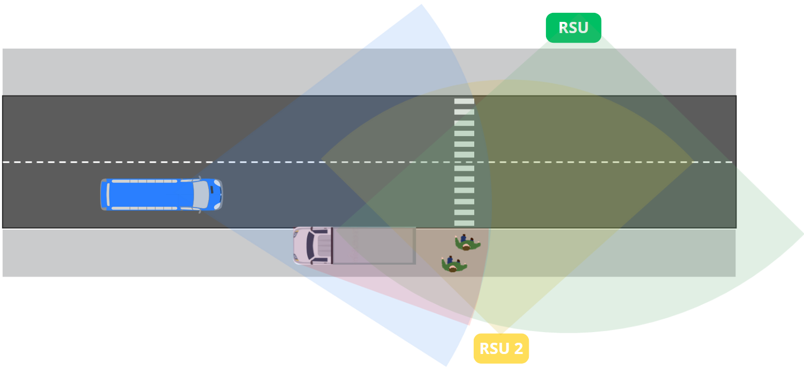

# CuttingThroughUncertaintyV2X



CTU is a pedestrian tracking simulation for V2X collaborative perception. The core logic lives in `src/CTU` where `main.py` drives a time-stepped loop that renders roadside units, vehicles and pedestrians; performs raycasting, clutter injection, extended Kalman filtering and greedy data association. All scenario parameters are declared in `constants.py` for easy tuning.

## Setup

```bash
conda env create -f environment.yml -n ctu
conda activate ctu
pip install -e .
```

## Run

```bash
cd src/CTU
python main.py
```