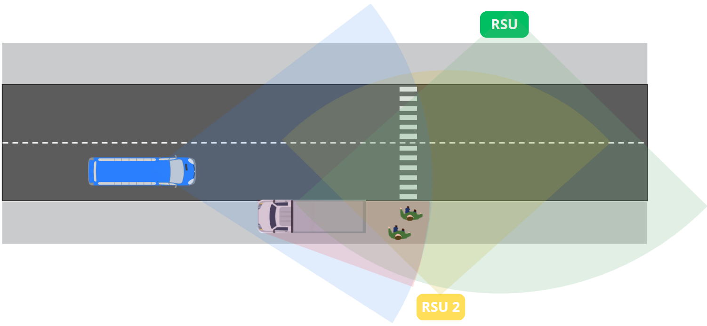

# CuttingThroughUncertaintyV2X

> Multi-Pedestrian Tracking in Occluded Environments Using Vehicular Communication and Set-Based Estimation
> 
> **IEEE ITSC 2026** — D. Nascivera, V. Narri, M. U. B. Niazi, K. H. Johansson




CTU is a pedestrian tracking simulation for V2X collaborative perception. The core logic lives in `src/CTU` where `main.py` drives a time-stepped loop that renders roadside units, vehicles and pedestrians; performs raycasting, clutter injection, extended Kalman filtering and greedy data association. All scenario parameters are declared in `constants.py` for easy tuning.

The `SBE` module contains the dedicated components for Set-Based Estimation, including the linear operators used to compute segment intersections and the Minkowski sum in linear form.

## Setup

```bash
conda env create -f environment.yml
conda activate v2x-perception
```

## Run

```bash
python src/CTU/main.py
```

## Citation

```bibtex
@inproceedings{nascivera2026itsc,
  title     = {Multi-Pedestrian Tracking in Occluded Environments Using Vehicular Communication and Set-Based Estimation},
  author    = {Nascivera, Davide and Narri, Vandana and Niazi, Muhammad Umar B. and Johansson, Karl H.},
  booktitle = {Proceedings of the 29th IEEE International Conference on Intelligent Transportation Systems (ITSC)},
  year      = {2026},
  address   = {Naples, Italy}
}
```
